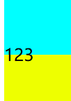

# ave-mujica倒计时(翻页时钟)

申明：灵感来源：[🤩原生JS实现一个翻页时钟最近很多人在考研备战，因为经常去考研自习室找男朋友，感觉很多人平板都放着一个翻页时间显示器， - 掘金](https://juejin.cn/post/7149837292452970532)

## html:

先是一个div包裹一个ul列表，

其中存放时间的li，里面有4个盒子，分别为上下盒子(用于翻页效果)，新旧时间(更新时间)

不理解？没关系看下面就知道了

```html
<div class="show">
        <ul class="time">
          <!-- 天 -->
           <li>
                <div class="upBox beforeTime"></div>
                <div class="downBox beforeTime"></div>
                <div class="upBox afterTime"></div>
                <div class="downBox afterTime"></div>
            </li>
            <li>
                <div class="upBox beforeTime"></div>
                <div class="downBox beforeTime"></div>
                <div class="upBox afterTime"></div>
                <div class="downBox afterTime"></div>
            </li>
            <li class="interval">D</li>
          <!-- 小时 -->
            <li>
                <div class="upBox beforeTime"></div>
                <div class="downBox beforeTime"></div>
                <div class="upBox afterTime"></div>
                <div class="downBox afterTime"></div>
            </li>
            <li>
                <div class="upBox beforeTime"></div>
                <div class="downBox beforeTime"></div>
                <div class="upBox afterTime"></div>
                <div class="downBox afterTime"></div>
            </li>
            <li class="interval">H</li>
            <!-- 分钟 -->
            <li>
                <div class="upBox beforeTime"></div>
                <div class="downBox beforeTime"></div>
                <div class="upBox afterTime"></div>
                <div class="downBox afterTime"></div>
            </li>
            <li>
                <div class="upBox beforeTime"></div>
                <div class="downBox beforeTime"></div>
                <div class="upBox afterTime"></div>
                <div class="downBox afterTime"></div>
            </li>
            <li class="interval">M</li>
            <!-- 秒 -->
            <li>
                <div class="upBox beforeTime"></div>
                <div class="downBox beforeTime"></div>
                <div class="upBox afterTime"></div>
                <div class="downBox afterTime"></div>
            </li>
            <li>
                <div class="upBox beforeTime"></div>
                <div class="downBox beforeTime"></div>
                <div class="upBox afterTime"></div>
                <div class="downBox afterTime"></div>
            </li>
            <li class="interval">S</li>
        </ul>
    </div>
```

## css

css的话比较简单，主要是设定line-height，即**行高**，控制文字位置，来实现上下盒子文字重叠，即上面的盒子显示文字上半部分，下面的盒子显示文字的下半部分

```css
.time li:nth-child(3n-2) {
            flex: 3;
            position: relative;
            /* 设置数字位置 */
            line-height: 200px;
            height:200px;
            margin: auto 10px;
            border-radius: 10px;
            text-align: center;
        }
```

类似效果可以看下面的图片



## js

js实现时间更新和动画效果

先是获取beforeTime赋值时间

```js
let Ten_of_dayLi = document
  .querySelector("li:nth-child(1)")
  .querySelectorAll(".beforeTime")
  .forEach((e) => (e.innerHTML = Ten_of_day));//给每个元素赋值
```

接着是更新时间实现动画效果

先获取afterTime，检测是否需要更新，秒可以不检测，因为秒实时更新

```js
let setTen_of_DayBox = document
    .querySelector("li:nth-child(1)")
    .querySelectorAll(".afterTime");
```

然后进行动画

再次申明函数的来源：[🤩原生JS实现一个翻页时钟最近很多人在考研备战，因为经常去考研自习室找男朋友，感觉很多人平板都放着一个翻页时间显示器， - 掘金](https://juejin.cn/post/7149837292452970532)

定义两个函数，一个更新before的盒子，一个是after的

先将before的

```js
const rotateUp = (e, time, n) => {
  //传入的为一开始翻转的元素，即前面下面的盒子，以及新时间，以及第几个li盒子
  let rotateDeg = 0;
  e.style.zIndex = 50;
  //这个是所有上面的盒子
  const allDownBox = document
    .querySelector(`li:nth-child(${n})`)
    .querySelectorAll(".downBox");
  //所有前面的盒子
  const beforeTime = document
    .querySelector(`li:nth-child(${n})`)
    .querySelectorAll(".beforeTime");
  // 让下面后面的盒子先不可见，然后设置为270°
  allDownBox[1].style.display = "none";
  allDownBox[1].transform = `rotateX(90deg)`;

  const animation = () => {
    rotateDeg -= 3;
    e.style.transform = `perspective(500px) rotateX(${rotateDeg}deg)`;
    if (rotateDeg === -90) {
      //让它更新为最近时间后隐藏
      e.innerHTML = time;
      e.style.zIndex = -1;
      //让刚刚上面隐藏的盒子重新显示出来并且完成90°-180°的旋转
      allDownBox[1].style.display = "block";
      allDownBox[0].style.zIndex = 1;
      rotateDown(allDownBox[1], 90);
      allDownBox[1].style.zIndex = 1;
    }
    if (rotateDeg == -150) {
      beforeTime[1].innerHTML = time;
    }
    if (rotateDeg > -180) {
      requestAnimationFrame(animation);
    }
  };
  animation();
};
```

定义一个函数，传入元素，要更新的时间，第几个li

1先创建选择角度

2然后获取目标li的所有before和after，将after向上选择90度，并隐藏

3.设定animation函数，每次减3度，实现向下翻页效果，上的话就为加+；

4.当角度为-90时，将after显现，并从入after的动画函数

5.当角度为-150时，将在翻转的before更新时间

6.直到角度为-180时，都调用animation

接着为after的animation

```js
const rotateDown = (e, rotateDeg) => {
  const animation = () => {
    rotateDeg -= 3;
    e.style.transform = `perspective(500px) rotateX(${rotateDeg}deg)`;
    if (rotateDeg > 0) {
      requestAnimationFrame(animation);
    }
  };
  animation();
};
```

传入角度，每次减3，直到角度到0，都不断回调。
